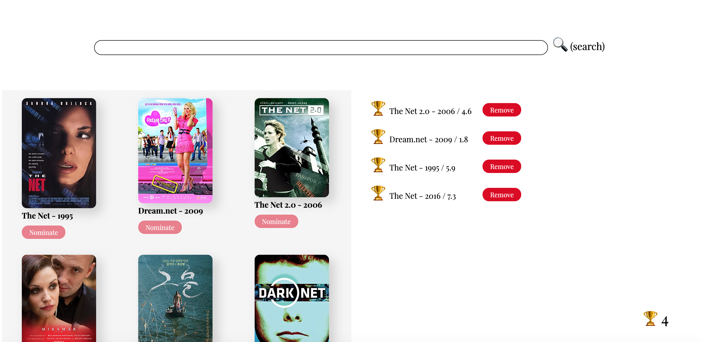

# OMBD App - Shopify Intern Application 📍
## Hello Shopify team! 👋
My name is Charlie Stableford(they/them) https://www.youtube.com/watch?v=DKWrk8NgCXM.

Thank you for viewing my application for a Shopify Intern(UX Development). I recently completed a one year degree in Web Dev/ Interaction Design that has complimented by background in Fine Arts and Psychology. During this program I became obsessed with improving a user's experience through meaningful data and quick prototyping.

I am excited about Shopify because it is an inclusive environment that fosters learning, growth and mentorship! 

My process for completing this was to start small, making sure that the functionality of the API calls worked manually, then I added in the search feature. After that I added a simple count feature before expanding to local storage. Once I added the localStorage I combined the counting and localStorage functionality. Then I added the bells and whistles!

## App description 📝
Technologies used: HTML, SCSS https://sass-lang.com/, Vanilla JS. 

Placeholders for when there is no img file(N/A) associated with a movie being searched is from https://placeholder.com/

The hosting for this website is piggy backing off of my portfolio and is done through Netlify.

## Usage
If you would like to change up the Sass you can install it by using npm install -g sass
OR if you are using Visual Studio code you can install the Easy Sass extension.

## Live site - https://www.charliestableford.com/ombdapi/index.html 🔗

## Screenshot 📷

